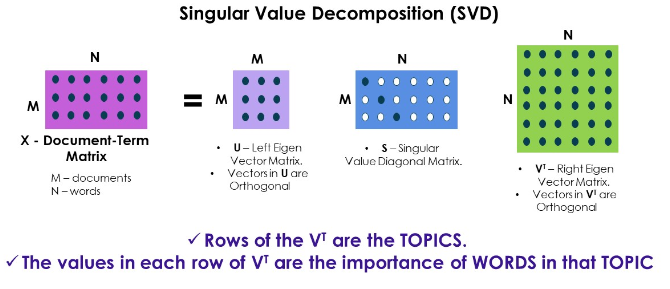

# Topic Modelling

## Apa itu Topic Modelling?

Topic Modelling adalah salah satu metode clustering. Clustering sendiri masuk dalam unsupervised learning yang mana tidak ada label untuk  suatu objek di dalamnya. Topic modelling digunakan untuk mengetahui data-data yang tersembunyi dalam suatu teks, data teks tersebut mempunyai hubungan satu dengan lainnya.

Untuk dapat mengetahui topik yang terkandung dalam suatu teks maka harus dilakukan ekstraksi fitur dari dokumen terlebih dahulu menggunakan Singular Value Decompotition (SVD) untuk mendapatkan kelompok kata yang saling mempunyai hubungan satu sama lain.


## Apa itu Latent Semantic Analysis (LSA)?

Latent Semantic Analysis (LSA) adalah suatu cara untuk ekstrasi teks dengan mengambil matrix of documents dan terms kemudian diuraikan menjadi dua matriks yang terpisah yaitu:

- Document topic matrix
- Topic term matrix

Oleh karena itu, metode LSA ini meliputi dekomposisi matriks pada document-term matrix menggunakan Singular Value Decomposition (SVD), yang biasanya digunakan untuk reduksi dimensi atau pengurangan noise.


## Singular Value Decomposition (SVD)

Singular Value Decomposition adalah konsep inti dalam machine learning dan digunakan untuk memahami data dengan banyak noise dan salah satu metode untuk reduksi dimensi yang paling umum digunakan. Rumus pada SVD yaitu sebagai berikut.


$$
\mathrm{A} \approx \mathbf{U S V}^{\mathbf{T}}
$$


Keterangan :

A = matrix dengan size m * n

U = orthogonal matrix dengan size m * m

S = diagonal matrix dengan size m * n

V = orthogonal matrix dengan size n * n





## Langkah-langkah melakukan Latent Semantic Analysis (LSA)

1. Install Library

   Hal yang pertama harus dilakukan adalah install library yang digunakan untuk proses LSA. Berikut list library yang akan digunakan, untuk menginstall library yaitu dengan membuka command prompt lalu mengetikkan perintah yang ada di bawah ini.

   ```python
   pip install scikit-learn
   ```

2. Import Library

   Import library yang digunakan untuk proses LSA. Berikut code untuk import library.

   ```python
   # ------ Import Library --------
   from sklearn.feature_extraction.text import TfidfVectorizer
   from sklearn.decomposition import TruncatedSVD
   ```

3. Mengubah teks menjadi TF-IDF

   Mengubah teks menjadi TF-IDF dengan library sklearn. Untuk rumus dari TF-IDF sendiri yaitu seperti berikut.

   

   $$
   W_{d t}=t f_{d t} * I D F_{t}
   $$

   

   Keterangan :

   d = dokumen ke-d

   t = kata ke-t dari kunci

   W = bobot dokumen ke-d terhadap kata ke-t

   tf = banyaknya kata yang dicari pada sebuah dokumen

   IDF = Invers Document Frequency

   

   Berikut code untuk mengubah teks menjadi TF-IDF.

   ```python
   # ------ TF-IDF --------
   vect = TfidfVectorizer(stop_words=list_stopwords,max_features=1000)
   vect_text = vect.fit_transform(papers['Abstrak_Lowercase'])
   print(vect_text.shape)
   print(vect_text)
   ```

   

4. Proses dekomposisi matriks (SVD)

   SVD digunakan untuk dekomposisi matriks dalam mencari kesamaan antar tiap kata. Rumus pada SVD yaitu sebagai berikut.

   

   $$
   \mathrm{A} \approx \mathbf{U S V}^{\mathbf{T}}
   $$
   ```python
   
   # ------ Singular Value Decomposition (SVD) --------
   lsa_model = TruncatedSVD(n_components=10, algorithm='randomized', n_iter=10, random_state=42)
   lsa_top=lsa_model.fit_transform(vect_text)
   print(lsa_top)
   print(lsa_top.shape)
   ```

   

5. Tampilkan hasil topik

   Kemudian untuk menampilkan hasil topik dengan code sebagai berikut.

   ```python
   # ------ Menampilkan hasil topik --------
   l=lsa_top[0]
   print("Document 0 :")
   for i,topic in enumerate(l):
     print("Topic ",i," : ",topic*100)
   ```

   

6. Tampilkan nilai komponen tiap topik

   Untuk menampilkan nilai komponen tiap topik dengan code sebagai berikut.

   ```python
   # ------ Menampilkan nilai komponen tiap topik --------
   print(lsa_model.components_.shape)
   print(lsa_model.components_)
   ```

   

7. Tampilkan kata penting yang ada dalam topik

   Untuk menampilkan kata penting yang ada dalam topik dengan code sebagai berikut.

   ```python
   # ------ Menampilkan kata penting tiap topik --------
   vocab = vect.get_feature_names_out()
   
   for i, comp in enumerate(lsa_model.components_):
       vocab_comp = zip(vocab, comp)
       sorted_words = sorted(vocab_comp, key= lambda x:x[1], reverse=True)[:10]
       print("Topic "+str(i)+": ")
       for t in sorted_words:
           print(t[0],end=" ")
       print("\n")
   ```

   Sehingga didapatkan hasil berikut untuk kata penting yang ada dalam 10 topik.

   ```
   Topic 0: 
   citra batik metode data proses sistem nilai hasil tekstur pengenalan 
   
   Topic 1: 
   citra batik tekstur ciri fitur kemiripan ekstraksi perolehan isi gambar 
   
   Topic 2: 
   bahasa algoritma madura mobile android teknologi pembelajaran aplikasi arsitektur pencarian 
   
   Topic 3: 
   tangan tulisan pengenalan sidik jari telapak skenario proses carakan senyum 
   
   Topic 4: 
   produksi peramalan perusahaan penjualan algoritma permintaan pelanggan penjadwalan bahasa komputer 
   
   Topic 5: 
   arsitektur bangkalan informasi dinas pelayanan bisnis tahapan peramalan kepegawaian sistem 
   
   Topic 6: 
   sidik jari pendeteksian citra manusia skenario gizi region titik pasien 
   
   Topic 7: 
   gizi pasien status peramalan obat balita penentuan data nilai kebutuhan 
   
   Topic 8: 
   gizi mobile pasien citra status android teknologi balita gerakan perusahaan 
   
   Topic 9: 
   gizi bahasa madura pasien pelanggan status batik perusahaan sidik jari
   ```


## Code Topic Modelling Latent Semantic Analysis (LSA)

Adapun code keseluruhan untuk melakukan topic modelling Latent Semantic Analysis (LSA) adalah sebagai berikut.

```python
# ------ Import Library --------
from sklearn.feature_extraction.text import TfidfVectorizer
from sklearn.decomposition import TruncatedSVD
```

```python
# ------ TF-IDF --------
vect = TfidfVectorizer(stop_words=list_stopwords,max_features=1000)
vect_text = vect.fit_transform(papers['Abstrak_Lowercase'])
print(vect_text.shape)
print(vect_text)
```

```python
# ------ Singular Value Decomposition (SVD) --------
lsa_model = TruncatedSVD(n_components=10, algorithm='randomized', n_iter=10, random_state=42)
lsa_top=lsa_model.fit_transform(vect_text)
print(lsa_top)
print(lsa_top.shape)
```

```python
# ------ Menampilkan hasil topik --------
l=lsa_top[0]
print("Document 0 :")
for i,topic in enumerate(l):
  print("Topic ",i," : ",topic*100)
```

```python
# ------ Menampilkan nilai komponen tiap topik --------
print(lsa_model.components_.shape)
print(lsa_model.components_)
```

```python
# ------ Menampilkan kata penting tiap topik --------
vocab = vect.get_feature_names_out()

for i, comp in enumerate(lsa_model.components_):
    vocab_comp = zip(vocab, comp)
    sorted_words = sorted(vocab_comp, key= lambda x:x[1], reverse=True)[:10]
    print("Topic "+str(i)+": ")
    for t in sorted_words:
        print(t[0],end=" ")
    print("\n")
```


## Referensi

```{bibliography}

```

